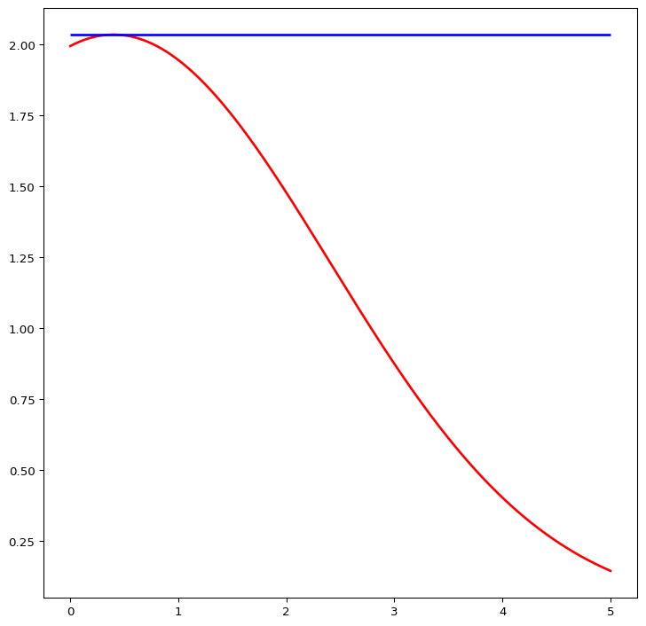
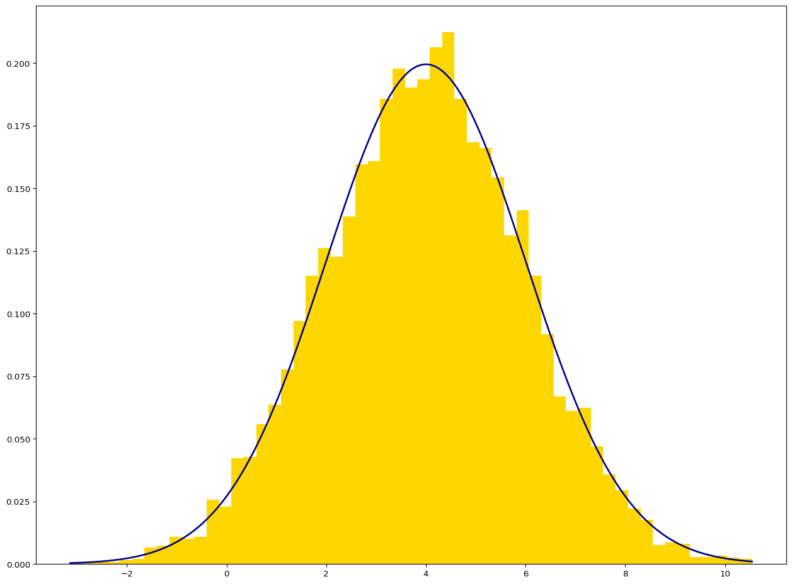
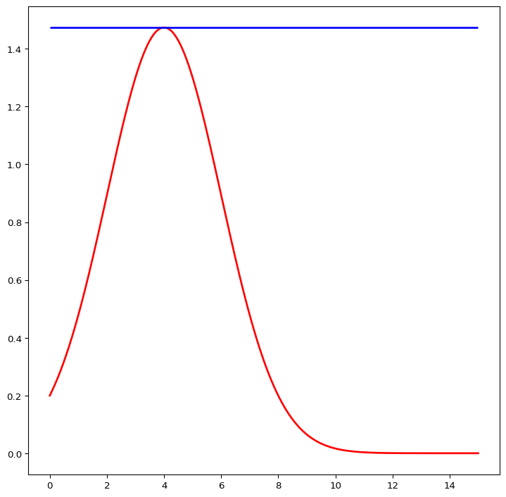
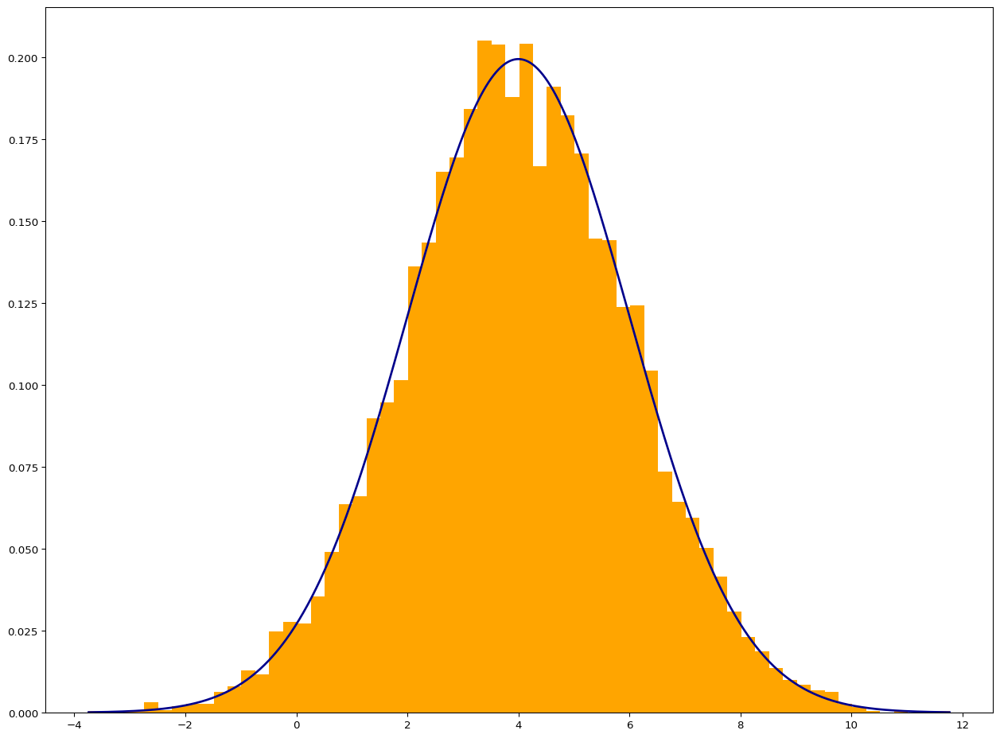
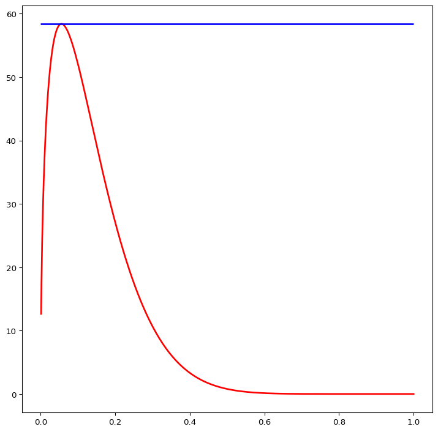
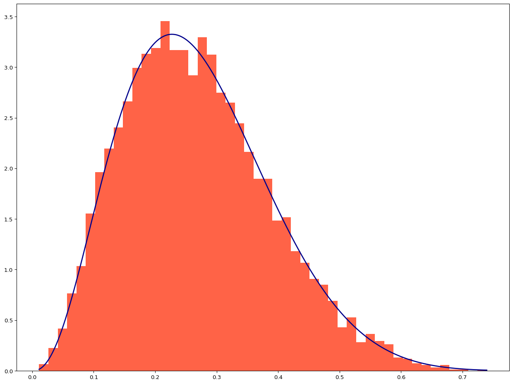
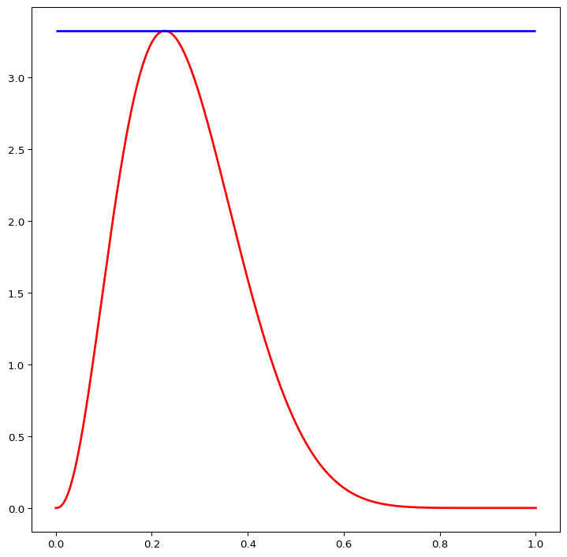
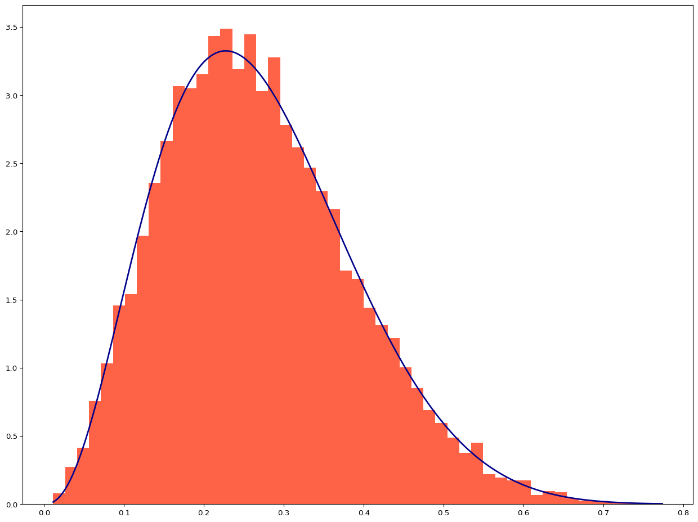

# Acceptance Rejection Method Using Python

## Problem i

From a Normal Distribution with mean 4 and standard deviation, run a
simulation of size 10000. (consider the candidate density, the density
of an expnential distribution with a mean of 10)

$$
\begin{aligned}
\text{Target Density:}~~ Y \sim \mathcal{N}(\mu = 4, \sigma = 2), \\
\text{Candidate Density:}~~\sim \mathcal{E}\text{xp}(\text{rate} = \frac{1}{10})
\end{aligned}
$$

<br><br>

------------------------------------------------------------------------

#### Code

``` python
import numpy as np
from scipy import stats
import matplotlib.pyplot as plt
from scipy.optimize import minimize_scalar
np.random.seed(100)
import time
def fv(x):
    res = stats.gamma.pdf(x, a = 1, scale = 10) ## a: shape parameter
    return res

def fy(x): 
    res = stats.norm.pdf(x, loc = 0, scale = 2)
    return res

def ratio(x):
    return fy(x) / fv(x)

res = minimize_scalar(fun = lambda x: - ratio(x), bounds = (0, 10), method = "bounded")
print(res)
M1 = np.abs(res['fun'])
M1
xx1 = np.linspace(0, 5, num = 1000)
yy1 = ratio(xx1) 

fig, ax = plt.subplots(1, 1, figsize = (9, 9))
ax.plot(xx1, yy1, color = "red", linewidth = 2)
ax.hlines(M1, [0], xx1.max(), color = "blue", linewidth = 2)
plt.show()

n = int(1e+4)
def ratio_2(x):
    return ratio(x) / M1

def sim_fun_1(m):
    i = -1
    sim_norm = np.zeros(m)
    while(i < m-1):
        u = stats.uniform.rvs(loc = 0, scale = 1, size = 3)
        v = -10 * np.log(u[0])
        temp = ratio_2(v)
        if u[1] < temp:
            i += 1
            a = -1 if u[2] < 0.5 else 1
            sim_norm[i] = a * v
    return (sim_norm + 4)

start_time_1 = time.time()
ress_1 = sim_fun_1(m = n)
End_time_1 = time.time()
time_1 = End_time_1 - start_time_1
print("""
mean of simulation set: {}, \n
standard deviation of simulation set: {}, \n 
duration time of simulation: {}. 
""".format(
ress_1.mean(),
np.sqrt(ress_1.var()),
time_1)
)


xx1 = np.linspace(ress_1.min(), ress_1.max(), num = 1000)
yy1 = stats.norm.pdf(xx1, loc = 4, scale = 2) 

fig, ax = plt.subplots(1, 1, figsize = (16, 12))
ax.hist(ress_1, color = "gold", bins = 'auto', density = True)
ax.plot(xx1, yy1, color = "darkblue", linewidth = 2)
plt.show()
```

     message: Solution found.
     success: True
      status: 0
         fun: -2.035007245294356
           x: 0.40000006166807844
         nit: 12
        nfev: 12

    mean of simulation set: 3.9742039747245936, 

    standard deviation of simulation set: 1.991267327339213, 
     
    duration time of simulation: 12.196222305297852. 





<br><br>

## Problem ii

``` python
import numpy as np
from scipy import stats
import matplotlib.pyplot as plt
from scipy.optimize import minimize_scalar
np.random.seed(100)
import time
def fv(x):
    res = stats.gamma.pdf(x, a = 1, scale = 1) ## a: shape parameter
    return res

def fy(x): 
    res = stats.norm.pdf(x, loc = 0, scale = 2)
    return res

def ratio(x):
    return fy(x) / fv(x)

res = minimize_scalar(fun = lambda x: - ratio(x), bounds = (0, 15), method = "bounded")
print(res)
M2 = np.abs(res['fun'])
M2
xx2 = np.linspace(0, 15, num = 1000)
yy2 = ratio(xx2) 

fig, ax = plt.subplots(1, 1, figsize = (9, 9))
ax.plot(xx2, yy2, color = "red", linewidth = 2)
ax.hlines(M2, [0], xx2.max(), color = "blue", linewidth = 2)
plt.show()

n = int(1e+4)
def ratio_2(x):
    return ratio(x) / M2

def sim_fun_2(m):
    i = -1
    sim_norm = np.zeros(m)
    while(i < m-1):
        u = stats.uniform.rvs(loc = 0, scale = 1, size = 3)
        v = -np.log(u[0])
        temp = ratio_2(v)
        if u[1] < temp:
            i += 1
            a = -1 if u[2] < 0.5 else 1
            sim_norm[i] = a * v
    return (sim_norm + 4)

start_time_2 = time.time()
ress_2 = sim_fun_2(m = n)
End_time_2 = time.time()
time_2 = End_time_2 - start_time_2
print("""
mean of simulation set: {}, \n
standard deviation of simulation set: {}, \n 
duration time of simulation: {}. 
""".format(
ress_2.mean(),
np.sqrt(ress_2.var()),
time_2)
)


xx2 = np.linspace(ress_2.min(), ress_2.max(), num = 1000)
yy2 = stats.norm.pdf(xx2, loc = 4, scale = 2) 

fig, ax = plt.subplots(1, 1, figsize = (16, 12))
ax.hist(ress_2, color = "orange", bins = 'auto', density = True)
ax.plot(xx2, yy2, color = "darkblue", linewidth = 2)
plt.show()
```

     message: Solution found.
     success: True
      status: 0
         fun: -1.4739034450607484
           x: 4.000000181030872
         nit: 10
        nfev: 10

    mean of simulation set: 3.9942489037323177, 

    standard deviation of simulation set: 2.0186611339784597, 
     
    duration time of simulation: 8.89002799987793. 





------------------------------------------------------------------------

------------------------------------------------------------------------

## Problem iii

From the beta distribution with the parameter of shape<sub>(1)</sub>
equal to 3.5 and the parameter of shape<sub>(2)</sub> equal to 9.5
simulate The candidate density is beta distribution with parameter
shape<sub>(1)</sub> equal to 3 and parameter shape<sub>(2)</sub> is
equal to one. Consider the number of data to be 100,00 and Plot the
histogram of the data and plot the target density on the histogram Fit
the data.

$$
\begin{aligned}
& \text{target variable:}~~~~Y \sim \text{Beta}(\text{shape}_1: 3.5, ~\text{shape}_2: 9.5),\\
& \text{Candidate Variable:}~~~V\sim \text{Beta}(\text{shape}_1: 3, ~\text{shape}_2: 1).\\
& F_V(v):~~\int_0^v 3x^2 dx = x^3|_0^v = v^3 \implies \\
& u = v^3 \implies v = u^{\frac{1}{3}}
\end{aligned}
$$

``` python
import numpy as np
from scipy import stats
import matplotlib.pyplot as plt
from scipy.optimize import minimize_scalar
np.random.seed(100)
import time
def fv(x):
    res = stats.beta.pdf(x, a = 3, b = 1) ## a: shape parameter
    return res

def fy(x): 
    res = stats.beta.pdf(x, a = 3.5, b = 9.5)
    return res

def ratio(x):
    return fy(x) / fv(x)

res = minimize_scalar(fun = lambda x: - ratio(x), bounds = (0, 1), method = "bounded")
print(res)
M3 = np.abs(res['fun'])
M3
xx3 = np.linspace(0, 1, num = 1000)
yy3 = ratio(xx3) 

fig, ax = plt.subplots(1, 1, figsize = (9, 9))
ax.plot(xx3, yy3, color = "red", linewidth = 2)
ax.hlines(M3, [0], xx3.max(), color = "blue", linewidth = 2)
plt.show()

n = int(1e+4)
def ratio_2(x):
    return ratio(x) / M3

def sim_fun_3(m):
    i = -1
    sim_beta = np.zeros(m)
    while(i < m-1):
        u = stats.uniform.rvs(loc = 0, scale = 1, size = 2)
        v = u[0] ** (1/3)
        temp = ratio_2(v)
        if u[1] < temp:
            i += 1
            sim_beta[i] = v
    return (sim_beta)

start_time_3 = time.time()
ress_3 = sim_fun_3(m = n)
End_time_3 = time.time()
time_3 = End_time_3 - start_time_3
print("""
mean of simulation set: {}, \n
standard deviation of simulation set: {}, \n 
duration time of simulation: {}. 
""".format(
ress_3.mean(),
np.sqrt(ress_3.var()),
time_3)
)


xx3 = np.linspace(ress_3.min(), ress_3.max(), num = 1000)
yy3 = stats.beta.pdf(xx3, a = 3.5, b = 9.5) 

fig, ax = plt.subplots(1, 1, figsize = (16, 12))
ax.hist(ress_3, color = "tomato", bins = 'auto', density = True)
ax.plot(xx3, yy3, color = "darkblue", linewidth = 2)
plt.show()
```

     message: Solution found.
     success: True
      status: 0
         fun: -58.39689888383045
           x: 0.055556841412919854
         nit: 13
        nfev: 13

    mean of simulation set: 0.2680762947901647, 

    standard deviation of simulation set: 0.1189450194273945, 
     
    duration time of simulation: 196.2863245010376. 

    /tmp/ipykernel_14237/1676012390.py:16: RuntimeWarning: invalid value encountered in divide
      return fy(x) / fv(x)





------------------------------------------------------------------------

------------------------------------------------------------------------

## Problem iv

``` python
import numpy as np
from scipy import stats
import matplotlib.pyplot as plt
from scipy.optimize import minimize_scalar
np.random.seed(100)
import time
def fv(x):
    res = stats.uniform.pdf(x, loc = 0, scale = 1) 
    return res

def fy(x): 
    res = stats.beta.pdf(x, a = 3.5, b = 9.5)
    return res

def ratio(x):
    return fy(x) / fv(x)

res = minimize_scalar(fun = lambda x: - ratio(x), bounds = (0, 1), method = "bounded")
print(res)
M4 = np.abs(res['fun'])
M4
xx4 = np.linspace(0, 1, num = 1000)
yy4 = ratio(xx4) 

fig, ax = plt.subplots(1, 1, figsize = (9, 9))
ax.plot(xx4, yy4, color = "red", linewidth = 2)
ax.hlines(M4, [0], xx4.max(), color = "blue", linewidth = 2)
plt.show()

n = int(1e+4)
def ratio_2(x):
    return ratio(x) / M4

def sim_fun_4(m):
    i = -1
    sim_beta = np.zeros(m)
    while(i < m-1):
        u = stats.uniform.rvs(loc = 0, scale = 1, size = 2)
        v = u[0] 
        temp = ratio_2(v)
        if u[1] < temp:
            i += 1
            sim_beta[i] = v
    return (sim_beta)

start_time_4 = time.time()
ress_4 = sim_fun_4(m = n)
End_time_4 = time.time()
time_4 = End_time_4 - start_time_4
print("""
mean of simulation set: {}, \n
standard deviation of simulation set: {}, \n 
duration time of simulation: {}. 
""".format(
ress_4.mean(),
np.sqrt(ress_4.var()),
time_4)
)


xx4 = np.linspace(ress_4.min(), ress_4.max(), num = 1000)
yy4 = stats.beta.pdf(xx4, a = 3.5, b = 9.5) 

fig, ax = plt.subplots(1, 1, figsize = (16, 12))
ax.hist(ress_4, color = "tomato", bins = 'auto', density = True)
ax.plot(xx4, yy4, color = "darkblue", linewidth = 2)
plt.show()
```

     message: Solution found.
     success: True
      status: 0
         fun: -3.324597755954131
           x: 0.22727300280007115
         nit: 11
        nfev: 11

    mean of simulation set: 0.2689819698409724, 

    standard deviation of simulation set: 0.11818173292694173, 
     
    duration time of simulation: 10.453761100769043. 




