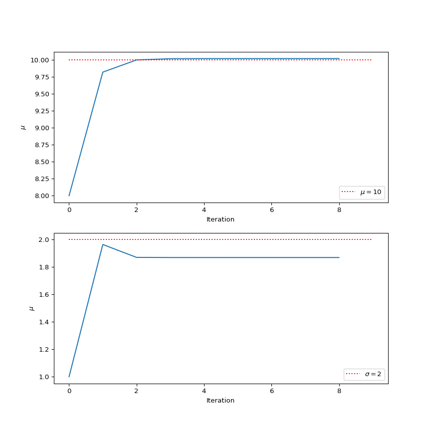

# EM algorithm Template Code


## Suppose we have a sample of 1000 from a normal distribution with a mean of 10 and a standard deviation of 2, and 100 of the samples are considered missing data. Now we want to estimate distribution parameters using EM algorithm.

## Initial values: $\mu_0 = 8, \sigma_0 = 1$

### Using python.

``` python
import numpy as np
from scipy import stats
import matplotlib.pyplot as plt

n = 1000
m = 100
seed = 1234
x = stats.norm.rvs(size = n, loc = 10, scale = 2, 
                   random_state = seed)
Missing = np.random.choice(np.arange(0, n), size = m) 
x[Missing] = np.nan


def EM(dat, mu0, sd0, tol = 1e-6, iter = 2e+3): 
    x_impute = dat.copy()
    k = 0
    muk = []
    muk.append(mu0)
    sdd = []
    sdd.append(sd0)
    while True: 
        # Expectation step 
        x_impute[Missing] = muk[k]
        # Maximization step 
        k += 1
        muk.append(x_impute.mean())
        sdd.append(x_impute.std())
        temp = np.abs(np.array([muk[k] - muk[k-1], sdd[k] - sdd[k-1]]))
        if np.all(temp < tol) or k > iter:
            break
    return dict(Mean_estimate = muk, STD_esimate = sdd, Num_Iteration = k + 1)


# define Initial values
mu0 = 8
sd0 = 1

result = EM(dat = x, mu0 = mu0, sd0 = sd0)
    
print(f"""
      Estimate of mu: {result['Mean_estimate'][-1]}, \n 
      Estimate of mu: {result['STD_esimate'][-1]}, \n
      Number of Iteration: {result['Num_Iteration']}
      """)
```


          Estimate of mu: 10.06881465116522, 
     
          Estimate of mu: 1.8474510490957459, 

          Number of Iteration: 9
          

``` python
    

# visualize estimates across iteration 
fig, ax = plt.subplots(2, 1, figsize = (9, 9))
xx = np.arange(0, 9)
# x
ax[0].plot(xx, result["Mean_estimate"])
ax[0].plot((0, 4, 9), (10, 10, 10), c = 'red', linestyle = 'dotted', label = r"$\mu = 10$")
ax[0].set_xlabel("Iteration")
ax[0].set_ylabel(r"$\mu$")
ax[0].legend()

# x
ax[1].plot(xx, result["STD_esimate"])
ax[1].plot((0, 4, 9), (2, 2, 2), c = 'red', linestyle = 'dotted', label = r"$\sigma = 2$")
ax[1].set_xlabel("Iteration")
ax[1].set_ylabel(r"$\mu$")
ax[1].legend()
plt.show()
```



### Using R.

``` r
# get data from python environment
x <- py$x

# Introduce 100 missing values
x[py$Missing] <- NA

# Define the EM algorithm function
em_algorithm <- function(x, mu0, sigma20, tol = 1e-6) {
  n <- length(x)
  k <- 0
  mu_k <- mu0
  sigma2_k <- sigma20
  
  while(TRUE) {
    # E-step: Calculate the expected values of the missing data
    x_imputed <- ifelse(is.na(x), mu_k, x)
    
    # M-step: Update the parameters
    mu_k1 <- sum(x_imputed, na.rm = TRUE) / n
    sigma2_k1 <- sum((x_imputed - mu_k1)^2, na.rm = TRUE) / n
    
    # Check for convergence
    if (all(abs(c(mu_k1, sigma2_k1) - c(mu_k, sigma2_k)) < tol)) {
      break
    }
    
    # Update the parameters for the next iteration
    mu_k <- mu_k1
    sigma2_k <- sigma2_k1
    k <- k + 1
  }
  
  return(list(mu = mu_k, sigma2 = sigma2_k, iter = k))
}

# Run the EM algorithm
result <- em_algorithm(x, mu0 = 8, sigma20 = 1)

# Print the estimated parameters and number of iterations
cat("Estimated mean:", result$mu, "\n",
    "Estimated variance:", result$sigma2, "\n",
    "Number of iterations:", result$iter, "\n", 
    sep = ""
    )
```

    Estimated mean:10.09109
    Estimated variance:3.100321
    Number of iterations:9
