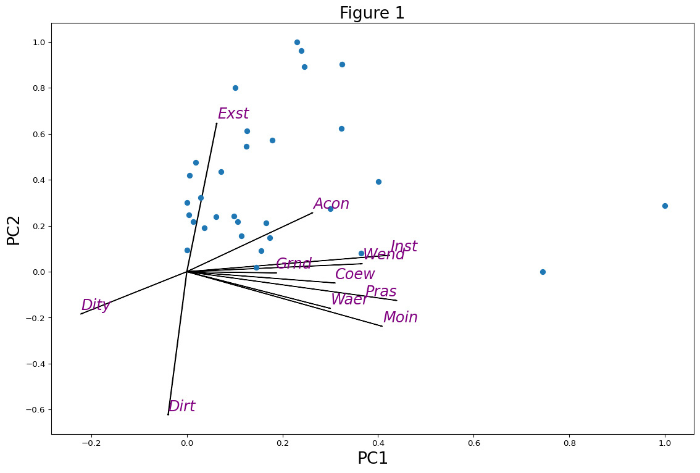

PCA With Python
================
Habib Ezatabadi

## import require libraries

``` python
import numpy as np
import pandas as pd
import matplotlib.pyplot as plt
```

## create a pca model

``` python
from sklearn.preprocessing import StandardScaler
from sklearn.decomposition import PCA
import plyer

## get path
pathh = plyer.filechooser.open_file()[0]
```

## implement Model

``` python
dat = pd.read_excel(pathh)
dat.shape
index = dat['RTO_Name'].values
ind = [2, 3, 8, 9, 10, 11, 12, 13, 14, 15, 16]
dat2 = pd.DataFrame(dat.iloc[:, ind])
dat2.index = index
dat2

## To define a standardizer for the data
scaler = StandardScaler() 
```

    C:\Users\habib\AppData\Local\Programs\Python\Python311\Lib\site-packages\openpyxl\worksheet\header_footer.py:48: UserWarning:

    Cannot parse header or footer so it will be ignored

``` python
colNames = dat2.columns
Index = dat2.index
dat_scaled = pd.DataFrame(scaler.fit_transform(dat2), columns = colNames, 
index = Index)
dat_scaled
```

<div>
<style scoped>
    .dataframe tbody tr th:only-of-type {
        vertical-align: middle;
    }

    .dataframe tbody tr th {
        vertical-align: top;
    }

    .dataframe thead th {
        text-align: right;
    }
</style>
<table border="1" class="dataframe">
  <thead>
    <tr style="text-align: right;">
      <th></th>
      <th>Distance to city</th>
      <th>Coast view</th>
      <th>Distance to airport</th>
      <th>Water</th>
      <th>Mountain</th>
      <th>Access to recreation</th>
      <th>Indigenous forest</th>
      <th>Exotic forest</th>
      <th>Wetland</th>
      <th>Protected areas</th>
      <th>Grassland</th>
    </tr>
  </thead>
  <tbody>
    <tr>
      <th>Northland</th>
      <td>-0.686103</td>
      <td>1.586737</td>
      <td>-0.742950</td>
      <td>-0.612804</td>
      <td>-0.782828</td>
      <td>1.610523</td>
      <td>0.097830</td>
      <td>1.921760</td>
      <td>1.681944</td>
      <td>-0.288129</td>
      <td>0.703268</td>
    </tr>
    <tr>
      <th>Auckland</th>
      <td>1.642576</td>
      <td>1.042838</td>
      <td>1.453905</td>
      <td>-0.791149</td>
      <td>-0.782828</td>
      <td>1.248176</td>
      <td>-0.521973</td>
      <td>-0.193935</td>
      <td>-0.117435</td>
      <td>-0.599138</td>
      <td>-0.413467</td>
    </tr>
    <tr>
      <th>Waikato</th>
      <td>1.460370</td>
      <td>-0.253715</td>
      <td>0.325011</td>
      <td>-0.198949</td>
      <td>-0.722732</td>
      <td>0.756420</td>
      <td>0.123552</td>
      <td>1.439688</td>
      <td>0.221058</td>
      <td>-0.292149</td>
      <td>1.910050</td>
    </tr>
    <tr>
      <th>Coromandel</th>
      <td>1.122623</td>
      <td>0.435060</td>
      <td>0.937476</td>
      <td>-0.744737</td>
      <td>-0.746784</td>
      <td>0.161136</td>
      <td>-0.314260</td>
      <td>-0.410327</td>
      <td>-0.437439</td>
      <td>-0.402754</td>
      <td>-1.011192</td>
    </tr>
    <tr>
      <th>Coastal Bay of Plenty</th>
      <td>0.082717</td>
      <td>-0.483791</td>
      <td>-1.021791</td>
      <td>-0.721735</td>
      <td>-0.628414</td>
      <td>0.083490</td>
      <td>0.208546</td>
      <td>1.627785</td>
      <td>-0.443297</td>
      <td>-0.469362</td>
      <td>-0.857253</td>
    </tr>
    <tr>
      <th>Rotorua</th>
      <td>0.513789</td>
      <td>-0.790882</td>
      <td>-0.784969</td>
      <td>0.124169</td>
      <td>-0.762075</td>
      <td>-0.874141</td>
      <td>-0.556055</td>
      <td>0.067029</td>
      <td>-0.605130</td>
      <td>-0.626512</td>
      <td>-1.057294</td>
    </tr>
    <tr>
      <th>Taupo</th>
      <td>-0.006164</td>
      <td>-0.790882</td>
      <td>-1.367395</td>
      <td>2.131880</td>
      <td>-0.527693</td>
      <td>1.921105</td>
      <td>-0.134862</td>
      <td>2.537547</td>
      <td>-0.132630</td>
      <td>-0.285582</td>
      <td>-0.872732</td>
    </tr>
    <tr>
      <th>Gisborne</th>
      <td>-1.712677</td>
      <td>0.342334</td>
      <td>-2.494167</td>
      <td>-0.502331</td>
      <td>0.174644</td>
      <td>-0.744731</td>
      <td>0.536604</td>
      <td>1.992106</td>
      <td>-0.523847</td>
      <td>-0.129995</td>
      <td>0.016901</td>
    </tr>
    <tr>
      <th>Hawke's Bay</th>
      <td>-1.339378</td>
      <td>0.068866</td>
      <td>-1.830211</td>
      <td>-0.136521</td>
      <td>-0.124518</td>
      <td>0.782302</td>
      <td>0.081913</td>
      <td>1.284276</td>
      <td>-0.267369</td>
      <td>-0.331107</td>
      <td>1.009243</td>
    </tr>
    <tr>
      <th>Ruapehu</th>
      <td>-0.241699</td>
      <td>-0.790882</td>
      <td>-1.195866</td>
      <td>-0.719512</td>
      <td>-0.683906</td>
      <td>0.394073</td>
      <td>0.046514</td>
      <td>-0.194476</td>
      <td>0.054649</td>
      <td>-0.195076</td>
      <td>-0.397781</td>
    </tr>
    <tr>
      <th>Taranaki</th>
      <td>-0.761652</td>
      <td>-0.315437</td>
      <td>-1.170520</td>
      <td>-0.700275</td>
      <td>-0.719424</td>
      <td>0.005844</td>
      <td>0.211963</td>
      <td>-0.625114</td>
      <td>-0.622521</td>
      <td>-0.230316</td>
      <td>-0.069157</td>
    </tr>
    <tr>
      <th>Whanganui</th>
      <td>-0.694991</td>
      <td>-0.711205</td>
      <td>-0.638488</td>
      <td>-0.712298</td>
      <td>-0.782822</td>
      <td>-1.417661</td>
      <td>-0.480049</td>
      <td>-0.542324</td>
      <td>-0.718449</td>
      <td>-0.577364</td>
      <td>-1.069369</td>
    </tr>
    <tr>
      <th>Manawatu</th>
      <td>-0.241699</td>
      <td>-0.759218</td>
      <td>-0.149954</td>
      <td>-0.700139</td>
      <td>-0.659114</td>
      <td>-1.262369</td>
      <td>-0.640070</td>
      <td>-0.855736</td>
      <td>-0.693552</td>
      <td>-0.603903</td>
      <td>-0.646857</td>
    </tr>
    <tr>
      <th>Wairarapa</th>
      <td>0.989302</td>
      <td>-0.179253</td>
      <td>1.000356</td>
      <td>-0.336734</td>
      <td>-0.621974</td>
      <td>-1.029432</td>
      <td>-0.426790</td>
      <td>-0.171011</td>
      <td>-0.565587</td>
      <td>-0.427922</td>
      <td>-0.276159</td>
    </tr>
    <tr>
      <th>Wellington</th>
      <td>1.731457</td>
      <td>-0.287360</td>
      <td>1.609405</td>
      <td>-0.794280</td>
      <td>-0.663815</td>
      <td>0.083490</td>
      <td>-0.415951</td>
      <td>-0.719367</td>
      <td>-0.613551</td>
      <td>-0.568114</td>
      <td>-1.236987</td>
    </tr>
    <tr>
      <th>Marlborough</th>
      <td>0.340471</td>
      <td>1.985651</td>
      <td>0.415818</td>
      <td>-0.357105</td>
      <td>1.251240</td>
      <td>0.109372</td>
      <td>0.040651</td>
      <td>0.234919</td>
      <td>-0.403388</td>
      <td>0.531133</td>
      <td>0.242280</td>
    </tr>
    <tr>
      <th>Nelson Tasman</th>
      <td>-0.659439</td>
      <td>0.066182</td>
      <td>-0.492312</td>
      <td>-0.433914</td>
      <td>0.680182</td>
      <td>0.937593</td>
      <td>1.180509</td>
      <td>0.966852</td>
      <td>-0.085032</td>
      <td>0.901347</td>
      <td>-0.754703</td>
    </tr>
    <tr>
      <th>West Coast</th>
      <td>-0.917193</td>
      <td>0.911825</td>
      <td>-0.200559</td>
      <td>1.767386</td>
      <td>3.543260</td>
      <td>2.619917</td>
      <td>4.281577</td>
      <td>-0.280869</td>
      <td>3.798765</td>
      <td>4.225748</td>
      <td>0.506587</td>
    </tr>
    <tr>
      <th>Kaikoura</th>
      <td>0.024944</td>
      <td>-0.441983</td>
      <td>0.139734</td>
      <td>-0.736888</td>
      <td>-0.295203</td>
      <td>-1.236487</td>
      <td>-0.655901</td>
      <td>-0.953673</td>
      <td>-0.717534</td>
      <td>-0.428481</td>
      <td>-1.150367</td>
    </tr>
    <tr>
      <th>Hurunui</th>
      <td>0.655998</td>
      <td>-0.461589</td>
      <td>0.735354</td>
      <td>-0.242412</td>
      <td>0.348016</td>
      <td>-0.925904</td>
      <td>-0.275464</td>
      <td>-0.393478</td>
      <td>-0.621240</td>
      <td>0.002759</td>
      <td>0.406527</td>
    </tr>
    <tr>
      <th>Canterbury</th>
      <td>1.007078</td>
      <td>0.290866</td>
      <td>1.096842</td>
      <td>2.188636</td>
      <td>1.043728</td>
      <td>0.937593</td>
      <td>-0.225364</td>
      <td>-0.319415</td>
      <td>0.352501</td>
      <td>0.364135</td>
      <td>2.484867</td>
    </tr>
    <tr>
      <th>Timaru</th>
      <td>-0.090601</td>
      <td>-0.722779</td>
      <td>0.102320</td>
      <td>-0.531367</td>
      <td>-0.529597</td>
      <td>-1.391779</td>
      <td>-0.689324</td>
      <td>-0.829078</td>
      <td>-0.645405</td>
      <td>-0.569832</td>
      <td>-0.701560</td>
    </tr>
    <tr>
      <th>Mackenzie</th>
      <td>-0.779428</td>
      <td>-0.790882</td>
      <td>-0.273799</td>
      <td>1.329440</td>
      <td>0.442936</td>
      <td>-1.081196</td>
      <td>-0.671121</td>
      <td>-0.862024</td>
      <td>-0.463984</td>
      <td>-0.106960</td>
      <td>0.403960</td>
    </tr>
    <tr>
      <th>Waitaki</th>
      <td>0.224926</td>
      <td>-0.572226</td>
      <td>0.112008</td>
      <td>-0.055447</td>
      <td>0.112961</td>
      <td>-0.925904</td>
      <td>-0.653659</td>
      <td>-0.737150</td>
      <td>-0.180777</td>
      <td>-0.300214</td>
      <td>0.530434</td>
    </tr>
    <tr>
      <th>Central Otago</th>
      <td>0.402688</td>
      <td>-0.790882</td>
      <td>1.009902</td>
      <td>-0.481597</td>
      <td>0.331983</td>
      <td>0.187018</td>
      <td>-0.690384</td>
      <td>-0.889893</td>
      <td>1.063173</td>
      <td>-0.373206</td>
      <td>1.503276</td>
    </tr>
    <tr>
      <th>Wanaka</th>
      <td>-1.019407</td>
      <td>-0.790882</td>
      <td>1.032463</td>
      <td>1.059540</td>
      <td>0.317922</td>
      <td>-0.460030</td>
      <td>-0.464954</td>
      <td>-0.968508</td>
      <td>-0.647968</td>
      <td>-0.064301</td>
      <td>-0.517491</td>
    </tr>
    <tr>
      <th>Queenstown</th>
      <td>-0.948302</td>
      <td>-0.790882</td>
      <td>1.684426</td>
      <td>0.824257</td>
      <td>0.451035</td>
      <td>-0.408266</td>
      <td>-0.528939</td>
      <td>-0.941932</td>
      <td>-0.565038</td>
      <td>-0.265253</td>
      <td>-0.402185</td>
    </tr>
    <tr>
      <th>Dunedin</th>
      <td>1.740345</td>
      <td>-0.291409</td>
      <td>0.025501</td>
      <td>-0.770189</td>
      <td>-0.730655</td>
      <td>0.497601</td>
      <td>-0.681868</td>
      <td>-0.684735</td>
      <td>-0.228192</td>
      <td>-0.596843</td>
      <td>-0.566696</td>
    </tr>
    <tr>
      <th>Clutha</th>
      <td>0.927085</td>
      <td>-0.381890</td>
      <td>0.082201</td>
      <td>-0.570520</td>
      <td>-0.714932</td>
      <td>-0.097683</td>
      <td>-0.489586</td>
      <td>0.276789</td>
      <td>0.009614</td>
      <td>-0.503719</td>
      <td>0.039331</td>
    </tr>
    <tr>
      <th>Southland</th>
      <td>-0.690547</td>
      <td>0.943797</td>
      <td>0.287143</td>
      <td>-0.291138</td>
      <td>0.199830</td>
      <td>-0.123565</td>
      <td>0.374117</td>
      <td>0.179032</td>
      <td>2.516736</td>
      <td>0.482781</td>
      <td>2.479312</td>
    </tr>
    <tr>
      <th>Fiordland</th>
      <td>-2.077089</td>
      <td>3.723873</td>
      <td>0.313117</td>
      <td>2.716731</td>
      <td>2.581575</td>
      <td>-0.356502</td>
      <td>2.332801</td>
      <td>-0.954737</td>
      <td>0.600925</td>
      <td>2.728328</td>
      <td>-0.234787</td>
    </tr>
  </tbody>
</table>
</div>

## Obtaining all the main components

``` python
from sklearn.preprocessing import MinMaxScaler
scaler2 = MinMaxScaler(feature_range=(0, 1))
pca = PCA(0.8) 
pca.fit(dat_scaled)
pca.n_components_  ## The number of components that cover 90% of the variance

Loading = pca.components_

temp1 = np.repeat("PC", 4); temp2 = [1, 2, 3, 4]
temp3 = list(map(lambda x, y: x + str(y), temp1, temp2))
df_loading = pd.DataFrame(Loading.T, index = colNames, columns = temp3)
df_loading
```

<div>
<style scoped>
    .dataframe tbody tr th:only-of-type {
        vertical-align: middle;
    }

    .dataframe tbody tr th {
        vertical-align: top;
    }

    .dataframe thead th {
        text-align: right;
    }
</style>
<table border="1" class="dataframe">
  <thead>
    <tr style="text-align: right;">
      <th></th>
      <th>PC1</th>
      <th>PC2</th>
      <th>PC3</th>
      <th>PC4</th>
    </tr>
  </thead>
  <tbody>
    <tr>
      <th>Distance to city</th>
      <td>-0.219206</td>
      <td>-0.181906</td>
      <td>0.574417</td>
      <td>-0.310554</td>
    </tr>
    <tr>
      <th>Coast view</th>
      <td>0.306437</td>
      <td>-0.048555</td>
      <td>0.043187</td>
      <td>-0.242322</td>
    </tr>
    <tr>
      <th>Distance to airport</th>
      <td>-0.038953</td>
      <td>-0.620115</td>
      <td>0.317013</td>
      <td>-0.104865</td>
    </tr>
    <tr>
      <th>Water</th>
      <td>0.297139</td>
      <td>-0.158074</td>
      <td>-0.142196</td>
      <td>0.204141</td>
    </tr>
    <tr>
      <th>Mountain</th>
      <td>0.405449</td>
      <td>-0.235702</td>
      <td>-0.152537</td>
      <td>0.041566</td>
    </tr>
    <tr>
      <th>Access to recreation</th>
      <td>0.260759</td>
      <td>0.253984</td>
      <td>0.457195</td>
      <td>-0.292648</td>
    </tr>
    <tr>
      <th>Indigenous forest</th>
      <td>0.420337</td>
      <td>0.070839</td>
      <td>-0.095976</td>
      <td>-0.263878</td>
    </tr>
    <tr>
      <th>Exotic forest</th>
      <td>0.062256</td>
      <td>0.642903</td>
      <td>0.176965</td>
      <td>-0.028062</td>
    </tr>
    <tr>
      <th>Wetland</th>
      <td>0.363113</td>
      <td>0.034148</td>
      <td>0.304077</td>
      <td>0.114888</td>
    </tr>
    <tr>
      <th>Protected areas</th>
      <td>0.435472</td>
      <td>-0.124187</td>
      <td>-0.108149</td>
      <td>-0.160795</td>
    </tr>
    <tr>
      <th>Grassland</th>
      <td>0.183865</td>
      <td>-0.005248</td>
      <td>0.412894</td>
      <td>0.771571</td>
    </tr>
  </tbody>
</table>
</div>

## create biplot

``` python
from adjustText import adjust_text
#| fig-width: 9
#| fig-height: 9
Scores = pca.transform(dat_scaled)

df_score = pd.DataFrame(scaler2.fit_transform(Scores[:, 0:2]), 
index = index, columns = ["PC1", "PC2"])


def abbreviate(strings, length = 4):
    if len(strings) > length:
        ri = round(length/2)
        le = length - ri
        res = strings[:le] + strings[(len(strings) - le):len(strings)]
    else:
        res = strings
    return res

fig, ax = plt.subplots(figsize=(14, 9))
for i, feature in enumerate(df_loading.index):
    ax.arrow(0, 0, df_loading.iloc[i, 0], 
    df_loading.iloc[i, 1])


Texts = [ax.text(df_loading.iloc[i, 0] * 1.01, 
        df_loading.iloc[i, 1] * 1.01, 
        abbreviate(feature), fontsize=18, color = "purple", 
        style = "italic") for i, feature in enumerate(df_loading.index)]
adjust_text(Texts)

ax.scatter(df_score.PC1, df_score.PC2)
ax.set_xlabel('PC1', fontsize=20)
ax.set_ylabel('PC2', fontsize=20)
ax.set_title('Figure 1', fontsize=20)
plt.show()
```


