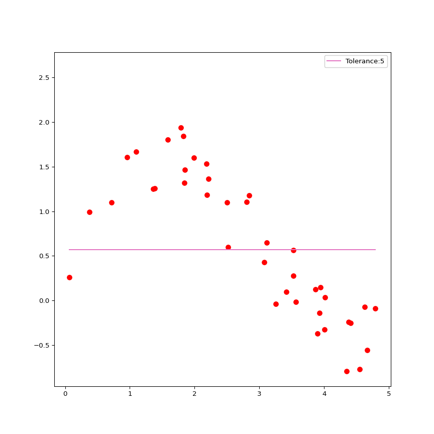

# Support Vector Regression (SVR)


- [Using python](#using-python)
  - [loading require libraries](#loading-require-libraries)
  - [Generate data](#generate-data)
    - [add noise to data](#add-noise-to-data)
  - [Fit SVR Model with linear
    kernel](#fit-svr-model-with-linear-kernel)

<br><br><br>

# Using python

------------------------------------------------------------------------

## loading require libraries

``` python
import numpy as np 
import matplotlib.pyplot as plt 
from sklearn.svm import SVR 
import matplotlib.animation as animation  
from celluloid import Camera
```

## Generate data

``` python
np.random.seed(1234)
xx = np.sort(5 * np.random.rand(40, 1), axis = 0)
# xx
yy = np.sin(xx).flatten()
# yy
```

### add noise to data

``` python
np.random.seed(1234)
err = np.random.rand(40)
yy += err 
```

## Fit SVR Model with linear kernel



------------------------------------------------------------------------

[animation.mp4](animation.mp4)
