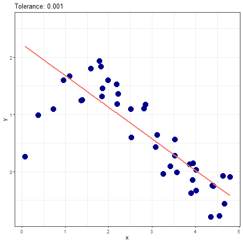

# Support Vector Regression (SVR)


- [Using python](#using-python)
  - [loading require libraries](#loading-require-libraries)
  - [Generate data](#generate-data)
    - [add noise to data](#add-noise-to-data)
  - [Fit SVR Model with linear
    kernel](#fit-svr-model-with-linear-kernel)
  - [fit SVR Model with poly kernel](#fit-svr-model-with-poly-kernel)
  - [fit SVR Model with radial
    kernel](#fit-svr-model-with-radial-kernel)
- [Using R Programming](#using-r-programming)
  - [fit SVR Model with linear
    kernel](#fit-svr-model-with-linear-kernel-1)
  - [fit SVR Model with Polynomial
    kernel](#fit-svr-model-with-polynomial-kernel)
  - [fit SVR Model with rbf(Radial Basis)
    kernel](#fit-svr-model-with-rbfradial-basis-kernel)
- [Simple Linear Model](#simple-linear-model)
- [Nonlinear Model (using spline
  regression)](#nonlinear-model-using-spline-regression)
- [Choosing best model for Generate data based on **MSE** for train
  data](#choosing-best-model-for-generate-data-based-on-mse-for-train-data)
  - [Best Model](#best-model)

<br><br><br>

# Using python

------------------------------------------------------------------------

## loading require libraries

``` python
import numpy as np 
import matplotlib.pyplot as plt 
from sklearn.svm import SVR 
import matplotlib.animation as animation  
from celluloid import Camera
```

## Generate data

``` python
np.random.seed(1234)
xx = np.sort(5 * np.random.rand(40, 1), axis = 0)
# xx
yy = np.sin(xx).flatten()
# yy
```

### add noise to data

``` python
np.random.seed(1234)
err = np.random.rand(40)
yy += err 
```

## Fit SVR Model with linear kernel

``` python
Tol = [0.001, 0.01, 0.05, 0.1, 0.2, 0.5, 1, 5]


fig = plt.figure(figsize = (9, 9))
camera = Camera(fig)
mse_py_linear = list()

for k in Tol: 
    Model_temp = SVR(kernel = 'linear', tol = k)
    Model_temp.fit(xx, yy)
    pred = Model_temp.predict(xx) 
    plt.scatter(x = xx, y = yy, color = 'red', s = 50)
    snapp = plt.plot(xx, pred)
    plt.legend(snapp, [f'Tolerance:{k}'])
    camera.snap() 
    temp2 = ((yy - pred)**2).mean()
    mse_py_linear.append(temp2)
# animation = camera.animate()

animation = camera.animate(interval=500, blit=True)  
animation.save('animation1.gif', writer='ffmpeg', fps = 1.5)  
plt.show()
```


------------------------------------------------------------------------

------------------------------------------------------------------------

## fit SVR Model with poly kernel

``` python
fig = plt.figure(figsize = (9, 9))
camera = Camera(fig)
mse_py_polynomial = list()
for k in Tol: 
    Model_temp = SVR(kernel = 'poly', tol = k)
    Model_temp.fit(xx, yy)
    pred = Model_temp.predict(xx) 
    plt.scatter(x = xx, y = yy, color = 'red', s = 50)
    plt.title("SVR Model with Kernel Radial (rbf)")
    plt.xlabel(r"$x$")
    plt.ylabel(r"$y$")
    plt.suptitle("@STATS9", x = 0.15, y = '0.95', fontsize = 12, color = 'darkblue', 
    alpha = 0.25)
    snapp = plt.plot(xx, pred)
    plt.legend(snapp, [f'Tolerance:{k}'])
    camera.snap() 
    temp2 = ((yy - pred)**2).mean()
    mse_py_polynomial.append(temp2)

animation = camera.animate(interval=500, blit=True)  
animation.save('animation2.gif', writer='ffmpeg', fps = 1.5)  
plt.show()
```


------------------------------------------------------------------------

------------------------------------------------------------------------

## fit SVR Model with radial kernel

``` python
fig = plt.figure(figsize = (9, 9))
camera = Camera(fig)
mse_py_rbf = list()
for k in Tol: 
    Model_temp = SVR(kernel = "rbf", tol = k, gamma = 0.1)
    Model_temp.fit(xx, yy)
    pred = Model_temp.predict(xx) 
    plt.scatter(x = xx, y = yy, color = 'red', s = 50)
    snapp = plt.plot(xx, pred)
    plt.legend(snapp, [f'Tolerance:{k}'])
    camera.snap() 
    temp2 = ((yy - pred)**2).mean()
    mse_py_rbf.append(temp2)

animation = camera.animate(interval=500, blit=True)  
animation.save('animation3.gif', writer='ffmpeg', fps = 1.5)  
plt.show()
```


------------------------------------------------------------------------

------------------------------------------------------------------------

------------------------------------------------------------------------

# Using R Programming

------------------------------------------------------------------------

## fit SVR Model with linear kernel

``` r
library(e1071)
library(ggplot2) 
library(gganimate)

xR <- py$xx
yR <- py$yy 
tols <- py$Tol |> unlist()

Models = list()
r_linear_mse <- c()
j <- 0
for (i in tols) {
    j <- j + 1
    tryCatch(
        expr = {
        Models[[j]] = svm(yR ~ xR, tolerance = i, 
                        kernel = 'linear', 
                            type = 'eps-regression', scale = FALSE) |>
                predict(type = "response") 
        r_linear_mse = c(r_linear_mse, ((Models[[j]] - yR) ** 2) |> mean())
        }, 
        error = function(e) {
            ## do Nothing
        }
    )

}
Models[[j]] <- rep(yR |> mean(), length(xR))
r_linear_mse = c(r_linear_mse, ((Models[[j]] - yR) ** 2) |> mean())

names(Models) <- paste0('Tolerance: ', tols)
dat <- as.data.frame(Models) |> 
        dplyr :: mutate(x = xR)  |> 
        tidyr :: pivot_longer(!x, names_to = "Tolerance", 
                values_to = "SVR_Preds") |> 
                dplyr ::  mutate(Tols = rep(paste0("Tolerance: ", tols), 40))

dat2 = data.frame(x = xR, y = yR)
P <- dat2 |> 
        ggplot(aes(x = x, y = y)) + 
        geom_point(color = "darkblue", 
                size = 5) + 
            geom_line(data = dat, aes(x = x, y = SVR_Preds, 
                    group = Tolerance, color = Tolerance), 
                    linewidth = 1) +
            theme_bw() + 
            theme(legend.position = 'none') + 
            labs(title = "{closest_state}")
P1 <- P + transition_states(Tols) 
animate(P1, renderer = gifski_renderer("Anim.gif", width = 1200, height = 800))
```



------------------------------------------------------------------------

## fit SVR Model with Polynomial kernel

``` r
r_polynomial_mse <- c()
Models = list()
j <- 0
for (i in tols) {
    j <- j + 1
    tryCatch(
        expr = {
        Models[[j]] = svm(yR ~ xR, tolerance = i, 
                        kernel = 'polynomial', 
                            type = 'eps-regression', scale = FALSE,
                            ) |>
                predict(type = "response") 
        r_polynomial_mse = c(r_polynomial_mse, ((Models[[j]] - yR) ** 2) |> mean())
        }, 
        error = function(e) {
            ## do Nothing
        }
    )

}
Models[[j]] <- rep(yR |> mean(), length(xR))
r_polynomial_mse = c(r_polynomial_mse, ((Models[[j]] - yR) ** 2) |> mean())

names(Models) <- paste0('Tolerance: ', tols)
dat <- as.data.frame(Models) |> 
        dplyr :: mutate(x = xR)  |> 
        tidyr :: pivot_longer(!x, names_to = "Tolerance", 
                values_to = "SVR_Preds") |> 
                dplyr ::  mutate(Tols = rep(paste0("Tolerance: ", tols), 40))

dat2 = data.frame(x = xR, y = yR)
P <- dat2 |> 
        ggplot(aes(x = x, y = y)) + 
        geom_point(color = "darkblue", 
                size = 5) + 
            geom_line(data = dat, aes(x = x, y = SVR_Preds, 
                    group = Tolerance, color = Tolerance), 
                    linewidth = 1) +
            theme_bw() + 
            theme(legend.position = 'none') + 
            labs(title = "{closest_state}")
P1 <- P + transition_states(Tols) 
animate(P1, renderer = gifski_renderer("Anim2.gif", width = 1200, height = 800))
```


------------------------------------------------------------------------

## fit SVR Model with rbf(Radial Basis) kernel

``` r
r_rbf_mse <- c()
Models = list()
j <- 0
for (i in tols) {
    j <- j + 1
    tryCatch(
        expr = {
        Models[[j]] = svm(yR ~ xR, tolerance = i, 
                        kernel = 'radial', 
                            type = 'eps-regression') |>
                predict(type = "response") 
        r_rbf_mse = c(r_rbf_mse, ((Models[[j]] - yR) ** 2) |> mean())
        }, 
        error = function(e) {
            ## do Nothing
        }
    )

}
Models[[j]] <- rep(yR |> mean(), length(xR))

names(Models) <- paste0('Tolerance: ', tols)
dat <- as.data.frame(Models) |> 
        dplyr :: mutate(x = xR)  |> 
        tidyr :: pivot_longer(!x, names_to = "Tolerance", 
                values_to = "SVR_Preds") |> 
                dplyr ::  mutate(Tols = rep(paste0("Tolerance: ", tols), 40))

dat2 = data.frame(x = xR, y = yR)
P <- dat2 |> 
        ggplot(aes(x = x, y = y)) + 
        geom_point(color = "darkblue", 
                size = 5) + 
            geom_line(data = dat, aes(x = x, y = SVR_Preds, 
                    group = Tolerance, color = Tolerance), 
                    linewidth = 1) +
            theme_bw() + 
            theme(legend.position = 'none') + 
            labs(title = "{closest_state}")
P1 <- P + transition_states(Tols) 
animate(P1, renderer = gifski_renderer("Anim3.gif", width = 1200, height = 800))
```


------------------------------------------------------------------------

# Simple Linear Model

``` r
dat2 <- data.frame(x = xR, y = yR)

Linear_Model <- lm(yR ~ xR)
dat2 |> 
    ggplot(aes(x = x, y = y)) + 
    geom_point(size = 5, col = 'red') + 
    geom_smooth(method = "lm", formula = y ~ x, 
        se = FALSE, color = 'darkblue') + 
    theme_bw() 
```


``` r
mse_linear_model <- ((yR - fitted(Linear_Model)) ** 2) |> mean()
```

------------------------------------------------------------------------

# Nonlinear Model (using spline regression)

``` r
library(splines)
spline_model <- lm(yR ~ bs(xR, degree  = 3, intercept = TRUE))
y_hat_spline <- fitted(spline_model)
dat3 <- dat2 |> dplyr :: mutate(yhat = y_hat_spline) 
dat2 |> 
    ggplot(aes(x = x, y = y)) + 
    geom_point(size = 5, color = 'red') + 
    geom_line(data = dat3, aes(x = x, y = yhat), 
        color = 'darkblue', linewidth = 1.5) + 
        theme_bw() 
```


``` r
mse_spline_model <- ((y_hat_spline - yR) ** 2) |> mean() 
```

------------------------------------------------------------------------

------------------------------------------------------------------------

# Choosing best model for Generate data based on **MSE** for train data

``` r
Models <- c(
    "Py_SVR|Linear|tol: 0.001", 
    "Py_SVR|Linear|tol: 0.01", 
    "Py_SVR|Linear|tol: 0.05", 
    "Py_SVR|Linear|tol: 0.1", 
    "Py_SVR|Linear|tol: 0.2", 
    "Py_SVR|Linear|tol: 0.5", 
    "Py_SVR|Linear|tol: 1", 
    "Py_SVR|Linear|tol: 5", 
    "Py_SVR|Poly|tol: 0.001", 
    "Py_SVR|Poly|tol: 0.01", 
    "Py_SVR|Poly|tol: 0.05", 
    "Py_SVR|Poly|tol: 0.1", 
    "Py_SVR|Poly|tol: 0.2", 
    "Py_SVR|Poly|tol: 0.5", 
    "Py_SVR|Poly|tol: 1", 
    "Py_SVR|Poly|tol: 5",
    "Py_SVR|rbf|tol: 0.001", 
    "Py_SVR|rbf|tol: 0.01", 
    "Py_SVR|rbf|tol: 0.05", 
    "Py_SVR|rbf|tol: 0.1", 
    "Py_SVR|rbf|tol: 0.2", 
    "Py_SVR|rbf|tol: 0.5", 
    "Py_SVR|rbf|tol: 1", 
    "Py_SVR|rbf|tol: 5",
    "R_SVR|Linear|tol: 0.001", 
    "R_SVR|Linear|tol: 0.01", 
    "R_SVR|Linear|tol: 0.05", 
    "R_SVR|Linear|tol: 0.1", 
    "R_SVR|Linear|tol: 0.2", 
    "R_SVR|Linear|tol: 0.5", 
    "R_SVR|Linear|tol: 1", 
    "R_SVR|Linear|tol: 5", 
    "R_SVR|Poly|tol: 0.001", 
    "R_SVR|Poly|tol: 0.01", 
    "R_SVR|Poly|tol: 0.05", 
    "R_SVR|Poly|tol: 0.1", 
    "R_SVR|Poly|tol: 0.2", 
    "R_SVR|Poly|tol: 0.5", 
    "R_SVR|Poly|tol: 1", 
    "R_SVR|Poly|tol: 5",
    "R_SVR|rbf|tol: 0.001", 
    "R_SVR|rbf|tol: 0.01", 
    "R_SVR|rbf|tol: 0.05", 
    "R_SVR|rbf|tol: 0.1", 
    "R_SVR|rbf|tol: 0.2", 
    "R_SVR|rbf|tol: 0.5", 
    "R_SVR|rbf|tol: 1", 
    "R_SVR|rbf|tol: 5",
    "Simple Linear Model", 
    "Spline Regression Model"
)

py_linear_mse = py$mse_py_linear |> unlist()
py_poly_mse = py$mse_py_poly |> unlist()
py_rbf_mse = py$mse_py_rbf |> unlist()

MSE <- c(
    py_linear_mse, 
    py_poly_mse, 
    py_rbf_mse, 
    r_linear_mse, 
    r_polynomial_mse, 
    r_rbf_mse, 
    mse_linear_model, 
    mse_spline_model
)


result <- data.frame(Models = Models, MSETrainData = MSE)
result |> 
    knitr :: kable(caption = 'table of results', align = 'c')
```

|           Models           | MSETrainData |
|:--------------------------:|:------------:|
| Py_SVR\|Linear\|tol: 0.001 |  0.2365320   |
| Py_SVR\|Linear\|tol: 0.01  |  0.2368262   |
| Py_SVR\|Linear\|tol: 0.05  |  0.2377236   |
|  Py_SVR\|Linear\|tol: 0.1  |  0.2416108   |
|  Py_SVR\|Linear\|tol: 0.2  |  0.2638492   |
|  Py_SVR\|Linear\|tol: 0.5  |  0.2362471   |
|   Py_SVR\|Linear\|tol: 1   |  0.3032032   |
|   Py_SVR\|Linear\|tol: 5   |  0.6253202   |
|  Py_SVR\|Poly\|tol: 0.001  |  0.1600311   |
|  Py_SVR\|Poly\|tol: 0.01   |  0.1600311   |
|  Py_SVR\|Poly\|tol: 0.05   |  0.1612801   |
|   Py_SVR\|Poly\|tol: 0.1   |  0.1612824   |
|   Py_SVR\|Poly\|tol: 0.2   |  0.1645749   |
|   Py_SVR\|Poly\|tol: 0.5   |  0.2001020   |
|    Py_SVR\|Poly\|tol: 1    |  0.1849049   |
|    Py_SVR\|Poly\|tol: 5    |  0.6253202   |
|  Py_SVR\|rbf\|tol: 0.001   |  0.0683804   |
|   Py_SVR\|rbf\|tol: 0.01   |  0.0684920   |
|   Py_SVR\|rbf\|tol: 0.05   |  0.0696832   |
|   Py_SVR\|rbf\|tol: 0.1    |  0.0735975   |
|   Py_SVR\|rbf\|tol: 0.2    |  0.0708204   |
|   Py_SVR\|rbf\|tol: 0.5    |  0.0741438   |
|    Py_SVR\|rbf\|tol: 1     |  0.0853098   |
|    Py_SVR\|rbf\|tol: 5     |  0.6253202   |
| R_SVR\|Linear\|tol: 0.001  |  0.2365320   |
|  R_SVR\|Linear\|tol: 0.01  |  0.2368262   |
|  R_SVR\|Linear\|tol: 0.05  |  0.2377236   |
|  R_SVR\|Linear\|tol: 0.1   |  0.2416108   |
|  R_SVR\|Linear\|tol: 0.2   |  0.2638492   |
|  R_SVR\|Linear\|tol: 0.5   |  0.2362471   |
|   R_SVR\|Linear\|tol: 1    |  0.3032032   |
|   R_SVR\|Linear\|tol: 5    |  0.6229853   |
|  R_SVR\|Poly\|tol: 0.001   |  0.1599982   |
|   R_SVR\|Poly\|tol: 0.01   |  0.1599982   |
|   R_SVR\|Poly\|tol: 0.05   |  0.1617742   |
|   R_SVR\|Poly\|tol: 0.1    |  0.1612593   |
|   R_SVR\|Poly\|tol: 0.2    |  0.1682962   |
|   R_SVR\|Poly\|tol: 0.5    |  0.1594122   |
|    R_SVR\|Poly\|tol: 1     |  0.1584572   |
|    R_SVR\|Poly\|tol: 5     |  0.6229853   |
|   R_SVR\|rbf\|tol: 0.001   |  0.0856874   |
|   R_SVR\|rbf\|tol: 0.01    |  0.0856373   |
|   R_SVR\|rbf\|tol: 0.05    |  0.0896660   |
|    R_SVR\|rbf\|tol: 0.1    |  0.0918451   |
|    R_SVR\|rbf\|tol: 0.2    |  0.1028817   |
|    R_SVR\|rbf\|tol: 0.5    |  0.1028817   |
|     R_SVR\|rbf\|tol: 1     |  0.1090400   |
|     R_SVR\|rbf\|tol: 5     |  0.6229853   |
|    Simple Linear Model     |  0.2267738   |
|  Spline Regression Model   |  0.0629210   |

table of results

## Best Model

``` r
result[which.min(result$MSETrainData), 'Models']
```

    [1] "Spline Regression Model"
