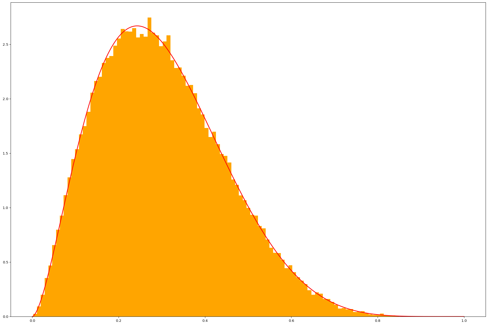

# acceptance-rejection method with python

## We want to generate data using R from the following distribution

$$
Y \sim \text{Beta}(shape_1: 2.7, shape_2: 6.3)
$$

``` python
import numpy as np 
from scipy import stats 
import matplotlib.pyplot as plt 
from scipy.optimize import minimize_scalar
a = 2.7
b = 6.3

def f_max(x):
    temp = stats.beta.pdf(x, a = a, b = b)
    return temp 

def f(x): 
    return - f_max(x)

res = minimize_scalar(f, bounds = (0, 1), method = "bounded")
c = np.abs(list(res.values())[0])

def sim_fun(n):
    i = 0
    j = 0
    simul = []
    while i < n:
        j += 1
        v = stats.uniform.rvs(loc = 0, scale = 1, size = 1)[0]
        u = stats.uniform.rvs(loc = 0, scale = 1, size = 1)[0]
        ratio = f_max(v) / c
        temp = True if u <= ratio else False 
        if temp:
            simul.append(v)
            i += 1
    return dict(sim_result = simul, c_count = j)


ress = sim_fun(1e+4)
sim_result = ress['sim_result']
c_count = ress['c_count']


print("""
      mean simulation: {}, \n
      mean Real: {}, \n
      variance simulation: {}, \n
      variance real: {}, \n
      number of repeatition: {}, \n
      Expected value: {}
      """.format(np.array(sim_result).mean(), 
                 a/(a + b), 
                 np.array(sim_result).var(), 
                 a*b / ((a + b)**2 * (a+b+1)), 
                 c_count, 
                 1e+4 * c))


ress = sim_fun(1e+5)
sim_result = ress['sim_result']
c_count = ress['c_count']


print("""
      mean simulation: {}, \n
      mean Real: {}, \n
      variance simulation: {}, \n
      variance real: {}, \n
      number of repeatition: {}, \n
      Expected value: {}
      """.format(np.array(sim_result).mean(), 
                 a/(a + b), 
                 np.array(sim_result).var(), 
                 a*b / ((a + b)**2 * (a+b+1)), 
                 c_count, 
                 1e+5 * c))


xx = np.linspace(0, 1, num = 10**4)
yy = f_max(xx)

fig, ax = plt.subplots(1, 1, figsize = (24, 16))
ax.hist(sim_result, color = "orange", bins = "auto", density = True)
ax.plot(xx, yy, color = "red", linewidth = 2)
plt.show()
```


          mean simulation: 0.30078913706326244, 

          mean Real: 0.30000000000000004, 

          variance simulation: 0.021028185265233243, 

          variance real: 0.021, 

          number of repeatition: 26657, 

          Expected value: 26697.440111491196
          

          mean simulation: 0.30010201474014875, 

          mean Real: 0.30000000000000004, 

          variance simulation: 0.021058133324354508, 

          variance real: 0.021, 

          number of repeatition: 268261, 

          Expected value: 266974.40111491195
          


